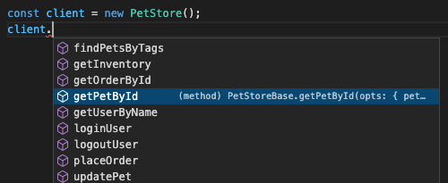

[](https://github.com/groupon/gofer-openapi/issues)


# `gofer-openapi`

CLI and Library to assist in converting OpenAPI Specifications into working
[Gofer][gofer] clients.

[gofer]: https://github.com/groupon/gofer



## CLI Usage

The basic idea is that this tool reads in an OpenAPI 3.x or 2.x specification
file and outputs a TypeScript file which contains all of the required type
declarations, as well as a definition of a class which extends `Gofer`.

You may then subclass this class to add a valid constructor as well as any
hand-written methods you wish to add.  By keeping the files separate, you
are free to regenerate the auto-generated base class as often as you need
(as the OpenAPI spec changes).

If you plan to use this regularly in your project, you may wish to install it
locally first:

```
$ npm i gofer-openapi
```

For current CLI usage, see:

```
$ npx gofer-openapi --help
```

### TypeScript

```
$ npx gofer-openapi \
  --class=PetStoreBase \
  < petstore.yml \
  > petstore-base.ts
```

Now you can create your subclass:

```ts
// File: petstore.ts
import { PetStoreBase } from './petstore-base';

export * from './petstore-base';

export class PetStore extends PetStoreBase {
  constructor() {
    super({}, 'PetStore', '1.0.0');
  }

  addTwoDogs() {
    return this.addPet([ /* ... */ ]);
  }
}
```

And use it:

```ts
import { PetStore } from './petstore';

async function query() {
  const client = new PetStore();
  const res = await client.addTwoDogs();
  const res2 = await client.someAutoGeneratedMethod();
}
```

### JavaScript

```
$ npx gofer-openapi \
  --class=PetStoreBase \
  --format=js \
  < petstore.yml \
  > petstore-base.js

# optionally, but highly recommended, *also* run:
$ npx gofer-openapi \
  --class=PetStoreBase \
  --format=dts \
  < petstore.yml \
  > petstore-base.d.ts
```

This will get you a CommonJS JavaScript file and accompanying TypeScript
declaration file, which you can now include in your existing JavaScript
project without needing to transpile.

The class and usage examples above will basically work exactly the same.

## API

```ts
import { readFile } from 'fs/promises';
import { goferFromOpenAPI } from 'gofer-openapi';

async function main() {
  const typeScriptSrc = await goferFromOpenAPI(
    await readFile('petstore.yml', 'utf8'),
    { className: 'PetStore', format: 'ts' }
  );
  // ...
}
```

See the the type declarations for full usage.

## Development

```
$ npm run watch
```

Runs the typescript compiler so you can edit the files in `src/`